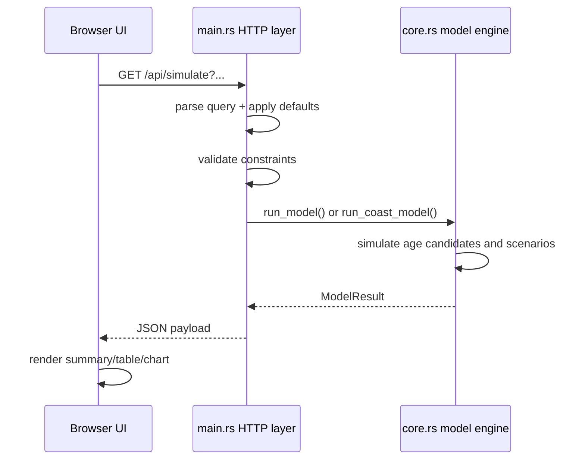
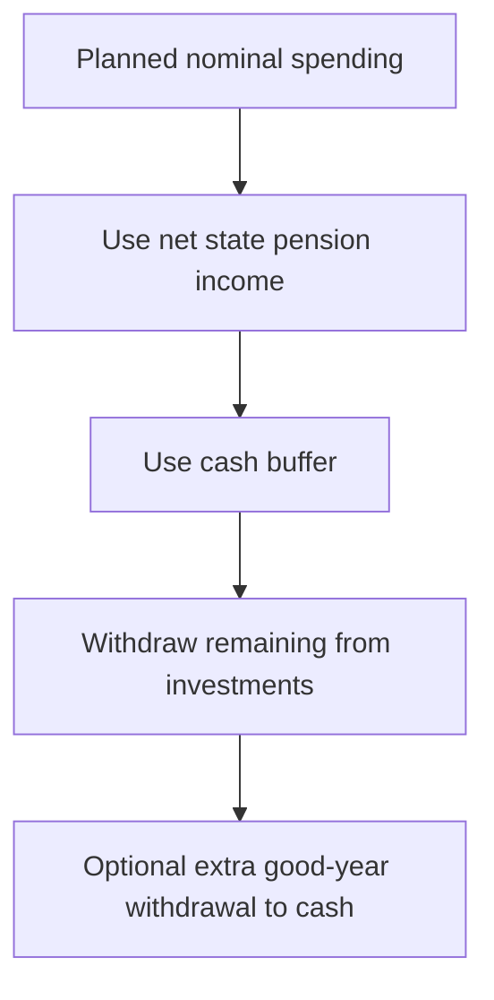

# FIRE Simulator: Project Documentation

This document explains how the project works end-to-end, including architecture, simulation flow, mathematical model, taxation logic, withdrawal strategies, API contracts, and known limitations.

## 1) What This Project Does

This project models retirement feasibility with Monte Carlo simulation across three investment pots and a cash buffer:

- ISA (tax free withdrawals)
- Taxable investments (capital gains tax on realized gains)
- Pension (withdrawable only from pension access age, taxed as income)
- Cash buffer

It supports:

- Retirement age sweep (find earliest age hitting a success threshold)
- CoastFIRE mode (find earliest age to stop contributions for a target retirement age)
- Multiple dynamic spending policies (Guardrails, Guyton-Klinger, VPW, Floor+Upside, Bucket)
- UK income tax bands or flat pension tax
- State pension income
- Browser UI that calls a Rust HTTP API

All reported pot outputs are in real terms (today's money), after applying inflation deflation.

## 2) High-Level Architecture

```mermaid
flowchart LR
    U[Browser UI<br/>index.html + app.js + styles.css] -->|GET /api/simulate?...| S[Rust HTTP Server<br/>src/main.rs]
    S -->|Build + validate Inputs| C[Simulation Core<br/>src/core.rs]
    C -->|ModelResult + AgeResult[]| S
    S -->|JSON response| U
    S -->|Serves static assets| U
```

### Component responsibilities

- `src/main.rs`
  - HTTP server and routing
  - Query parsing and validation
  - Conversion from UI/API values to internal normalized inputs
  - Serialization of model outputs to JSON
- `src/core.rs`
  - Monte Carlo engine
  - Portfolio growth/contribution/withdrawal dynamics
  - Spending policy logic
  - Tax calculations (income tax + CGT)
  - Scenario aggregation and percentile metrics
- `web/index.html`, `web/app.js`, `web/styles.css`
  - Input form and tooltips
  - API calls to `/api/simulate`
  - Results rendering (summary cards, table, chart)
  - Input persistence and saved presets in localStorage

## 3) Runtime Modes

### Retirement Sweep mode

- Tests every retirement age in `[currentAge, maxAge]`.
- For each candidate age, runs `simulations` Monte Carlo scenarios.
- Chooses:
  - `selectedRetirementAge`: first age with success rate >= threshold
  - `bestRetirementAge`: age with maximum success rate

### CoastFIRE mode

- Uses target retirement age:
  - explicit `coastRetirementAge`, or
  - model-picked age from a normal sweep if omitted
- Tests every contribution stop age in `[currentAge, targetRetirementAge]`.
- Reports the earliest coast age that satisfies the threshold.

## 4) Request/Execution Flow



## 5) Simulation Model

### 5.1 Annual timeline

The model runs in annual steps.

- Pre-retirement years:
  - Sample returns + inflation
  - Apply growth
  - Apply contributions (subject to ISA cap + overflow to taxable)
- Retirement years:
  - Plan real spending according to selected strategy
  - Convert planned real spending to nominal for that year
  - Withdraw from pots (cash first, then investments by configured order)
  - Apply tax effects (income tax and CGT)
  - Apply portfolio growth and inflation
  - Track achieved income vs target

### 5.2 Success/failure rule

A scenario fails immediately in a year where:

- `realized_nominal_spending < planned_nominal_spending`

When a scenario fails:

- Success = `false`
- Terminal pot fields are forced to `0`
- Income ratio stats are still recorded up to failure

This means failures are intentionally represented in terminal statistics.

### 5.3 Aggregation metrics

For each tested age:

- `successRate = successful_scenarios / simulations`
- Percentiles for retirement and terminal pot values per pot:
  - median (P50)
  - P10 ("worst decile")
- Spending adequacy:
  - P10 of minimum annual income ratio
  - median of average annual income ratio

Percentiles use linear interpolation between sorted points.

## 6) Mathematical Details

## 6.1 Contribution growth and ISA cap

For year index `y` (years since current age):

- `contribution_multiplier = (1 + contribution_growth_rate)^y`

Requested contributions:

- `isa_req = isa_annual_contribution * contribution_multiplier`
- `taxable_req = taxable_annual_contribution * contribution_multiplier`
- `pension_req = pension_annual_contribution * contribution_multiplier`

ISA cap and overflow:

- `isa_contrib = clamp(isa_req, 0, isa_limit)`
- `overflow = max(isa_req - isa_contrib, 0)`
- `taxable_contrib = max(taxable_req, 0) + overflow`

## 6.2 Market return sampling

The current model is Gaussian with partial correlation and clamping:

- Draw independent normals `z1, z2, z3 ~ N(0,1)`.
- `orth = sqrt(1 - corr^2)`
- `r_isa = clamp(mu_isa + sigma_isa * z1, -0.95, 2.5)`
- `r_tax = clamp(mu_tax + sigma_tax * z1, -0.95, 2.5)`
- `r_pen = clamp(mu_pen + sigma_pen * (corr*z1 + orth*z2), -0.95, 2.5)`
- `infl = clamp(mu_infl + sigma_infl * z3, -0.03, 0.20)`

Notes:

- ISA and taxable currently share the same shock `z1`.
- Pension has tunable correlation to ISA/taxable via `corr`.
- Inflation is sampled independently.

## 6.3 Inflation and real vs nominal

Price index update:

- `price_index_t = price_index_(t-1) * (1 + infl_t)`

Real reporting:

- `real_value = nominal_value / price_index`

All displayed pot statistics in the API/UI are real (today's money).

## 6.4 Realized real return used by spending rules

After withdrawals, the model measures invested-asset real return as:

- `nominal_return = end_invested / start_invested - 1`
- `real_return = (1 + nominal_return) / (1 + inflation) - 1`

This `real_return` drives bad/good year spending adjustments.

## 6.5 Spending policy formulas

Let:

- `S_t`: current real spending
- `S_target`: target real spending
- `S_min = S_target * min_floor`
- `S_max = S_target * max_ceiling`
- `R_prev`: previous-year realized real return

All strategies clamp final spending to `[S_min, S_max]`.

### Dynamic Guardrails

- If `R_prev < bad_threshold`: `S_t <- S_t * (1 - bad_cut)`
- Else if `R_prev > good_threshold`: `S_t <- S_t * (1 + good_raise)`

### Guyton-Klinger

- Compute current withdrawal rate: `wr_t = S_t / available_real_assets`
- Initial withdrawal rate at retirement:
  - `wr_0 = target_income / retirement_total_real`
- Guardrails:
  - lower = `wr_0 * gk_lower_guardrail`
  - upper = `wr_0 * gk_upper_guardrail`
- If `R_prev < bad_threshold` and `wr_t > upper`: cut by `bad_cut`
- Else if `R_prev > good_threshold` and `wr_t < lower`: raise by `good_raise`

### VPW (Variable Percentage Withdrawal)

Uses annuity-style withdrawal rate:

- `n = years_remaining`
- `r = vpw_expected_real_return`
- If `r ~= 0`: `wr = 1 / n`
- Else: `wr = r / (1 - (1+r)^(-n))`
- `S_t = available_real_assets * wr`

### Floor + Upside

- Start at at least floor: `S_t = max(S_t, S_min)`
- Bad year cut: if `R_prev < bad_threshold`, apply `bad_cut`
- Positive-year participation:
  - if `R_prev > 0`, multiply by `(1 + R_prev * floor_upside_capture)`

### Bucket

- Spending behaves like a conservative guardrails variant:
  - bad years: full cut
  - good years: half raise
- In good years, attempts to refill cash buffer:
  - `cash_target = planned_spending * bucket_target_years`
  - `shortfall = max(cash_target - cash_buffer, 0)`
  - `refill_cap = planned_spending * good_year_extra_buffer_withdrawal`
  - extra withdrawal = `min(shortfall, refill_cap)` (or shortfall if cap <= 0)

## 6.6 Withdrawal waterfall and net-targeting

### Order of operations in a retirement year



### Investment withdrawal order

- Before pension access age:
  - ISA + taxable only
- After pension access:
  - One of: pro-rata / ISA-first / taxable-first / pension-first

### Net-targeting from taxed pots

For pension and taxable withdrawals, the model solves "how much gross do I sell/withdraw to deliver a target net amount?" using binary search (40 iterations).

This is important because:

- Pension withdrawals incur income tax
- Taxable sales may incur CGT

## 6.7 Tax model

### Pension/state pension income tax

Two modes:

- Flat rate: `tax = gross_income * flat_rate`
- UK bands:
  - personal allowance with taper
  - basic/higher/additional bands
  - thresholds scaled by inflation index for nominal-year computation

State pension:

- Starts at `statePensionStartAge`
- Gross amount = `statePensionIncome * price_index`
- Taxed under the selected pension tax mode
- Net amount contributes toward yearly spending

### CGT on taxable account

For a gross sale `G` from account value `V` with basis `B`:

- basis portion sold: `B_sold = B * (G / V)`
- realized gain: `gain = G - B_sold`
- allowance used: `allow = min(allowance_remaining, gain)`
- taxable gain: `tax_gain = max(gain - allow, 0)`
- CGT: `tax = tax_gain * cgt_rate`
- net proceeds: `net = G - tax`

Basis and allowance are updated after each sale.

## 7) Core Data Structures

- `Inputs`: normalized model configuration (rates in decimal form, not percent)
- `Portfolio`: mutable pot balances for one scenario
- `ScenarioResult`: one Monte Carlo path output
- `AgeResult`: aggregated statistics for one tested age
- `ModelResult`: all tested ages + selected/best index

## 8) API Contract

### Endpoints

- `GET /` and `/index.html`: web app
- `GET /styles.css`, `GET /app.js`: assets
- `GET /api/simulate?...`: simulation API

### Request model

The UI sends query parameters. Notable parameter groups:

- Age controls: `currentAge`, `pensionAccessAge`, `maxAge`, `horizonAge`
- Starting pots: `isaStart`, `taxableStart`, `taxableBasisStart`, `pensionStart`, `cashStart`
- Contributions: `isaContribution`, `isaLimit`, `taxableContribution`, `pensionContribution`, `contributionGrowth`
- Return model: `isaMean`, `isaVol`, `taxableMean`, `taxableVol`, `pensionMean`, `pensionVol`, `correlation`, `inflationMean`, `inflationVol`
- Tax: `cgtRate`, `cgtAllowance`, `taxableTaxDrag`, `pensionTaxMode`, UK band/taper/rates, state pension controls
- Spending policy: `targetIncome`, `badThreshold`, `goodThreshold`, `badCut`, `goodRaise`, `minFloor`, `maxCeiling`, `extraToCash`, `cashGrowth`, `withdrawalOrder`
- Rich strategy controls: `withdrawalPolicy`, `gkLowerGuardrail`, `gkUpperGuardrail`, `vpwRealReturn`, `floorUpsideCapture`, `bucketYearsTarget`
- Monte Carlo controls: `simulations`, `successThreshold`, `seed`
- Mode controls: `analysisMode`, `coastRetirementAge`

### Response model

Top-level fields:

- `mode`: `retirement` or `coast`
- `withdrawalPolicy`
- `coastRetirementAge`
- `successThreshold`
- `selectedRetirementAge`
- `bestRetirementAge`
- `ageResults`: array

Each `ageResults[]` item includes:

- tested age
- success rate
- retirement pot stats (median/P10 total and per pot)
- terminal pot stats (median/P10 total and per pot)
- spending adequacy stats (`p10MinIncomeRatio`, `medianAvgIncomeRatio`)

## 9) UI Behavior

- Form values are sent directly as query params to `/api/simulate`.
- Results are displayed as:
  - summary cards
  - detailed age table
  - Chart.js success-rate line chart with hover details
- Form state auto-saves in localStorage.
- Named presets can be saved/loaded/deleted in localStorage.
- Field tooltips are built from input `title` attributes.

## 10) Validation and Error Behavior

Validation happens server-side before simulation. Examples:

- age ordering constraints (`currentAge <= maxAge < horizonAge`)
- percentage range constraints
- UK band consistency checks
- taxable basis bounds (`0 <= basis <= taxableStart`)
- strategy parameter bounds

On validation failure:

- API returns `400` with JSON `{"error":"..."}`.

## 11) Performance Notes

- Complexity is roughly:
  - `O(number_of_tested_ages * simulations * years_to_horizon)`
- Most runtime comes from Monte Carlo loops and withdrawal/tax computations.
- In CoastFIRE mode, if target retirement age is not provided, a baseline sweep runs first, then coast sweep runs.

## 12) Current Modeling Assumptions and Limitations

- Annual timestep model (no intra-year dynamics).
- Return process is Gaussian and i.i.d. per year (with limited correlation structure).
- Inflation is independent from asset returns.
- No explicit salary model; contribution growth is a generic contribution escalator.
- No transaction fees/slippage model.
- Tax model focuses on configured pension income tax + CGT, not full tax system complexity.

## 13) How to Run and Test

Run server:

```bash
cargo run -- serve 8080
```

Open:

- `http://127.0.0.1:8080/`

Run checks:

```bash
cargo fmt
cargo test
cargo clippy -- -W clippy::all
node --check web/app.js
```

## 14) Extension Guide

### Add a new withdrawal strategy

1. Add enum variant in `WithdrawalStrategy` (`src/core.rs`).
2. Add any new input fields to `Inputs`.
3. Implement behavior inside `plan_real_spending(...)`.
4. Add strategy-specific yearly behavior in `run_withdrawal_year(...)` if needed.
5. Wire CLI/API parsing in `src/main.rs`.
6. Add UI controls in `web/index.html`.
7. Add tests in `src/core.rs` and parser tests in `src/main.rs`.

### Improve return modeling

Recommended next steps:

- Full covariance matrix sampling across ISA/taxable/pension/inflation
- Fat-tailed sampling (Student-t or jump process)
- Regime-switching model
- Historical block bootstrap

